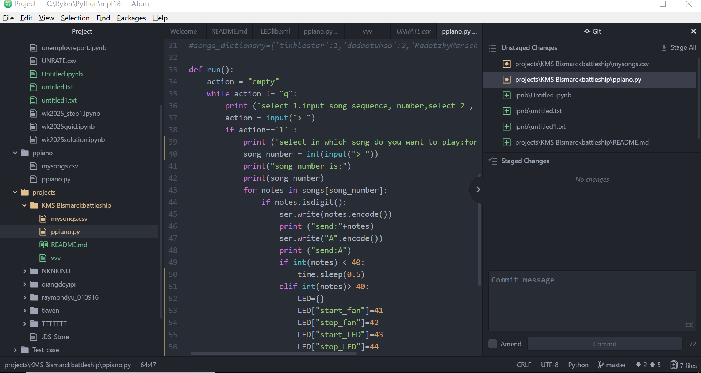
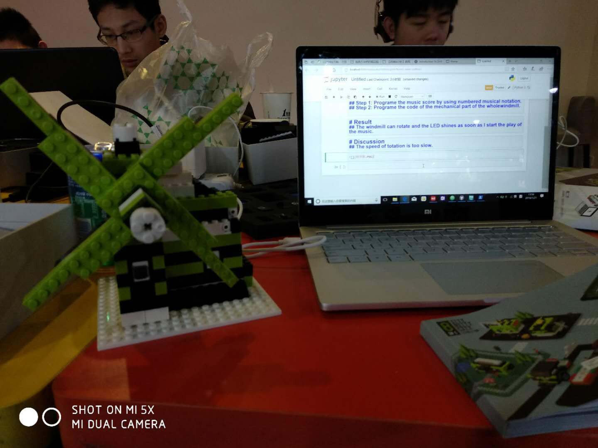

# The Purpose of This Activity
## Complete the model of a windmill, which can rotate with the music controled by the computer.

# The Process of This Activity
## Step 1: Programe the music score by using numbered musical notation.
## Step 2: Programe the code of the mechanical part of the wholewindmill.

# Result 
## The windmill can rotate and the LED shines as soon as I start the play of the music.

# Discussion
## The speed of totation is too slow.

