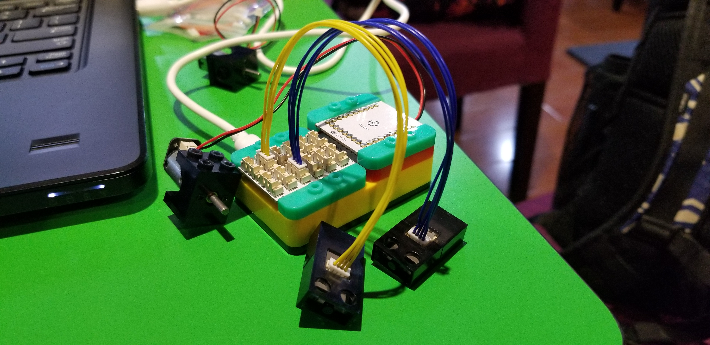
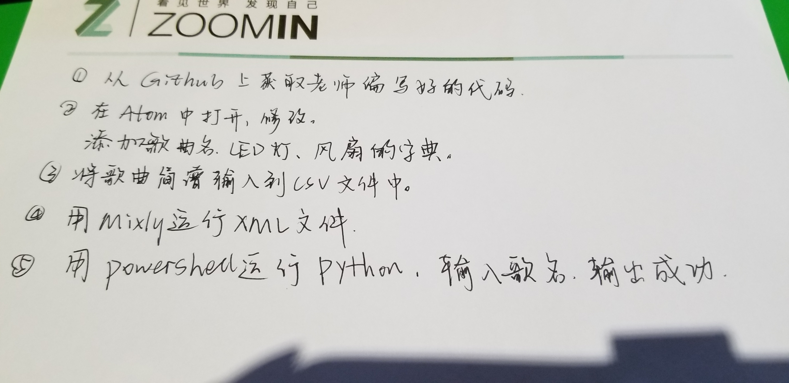
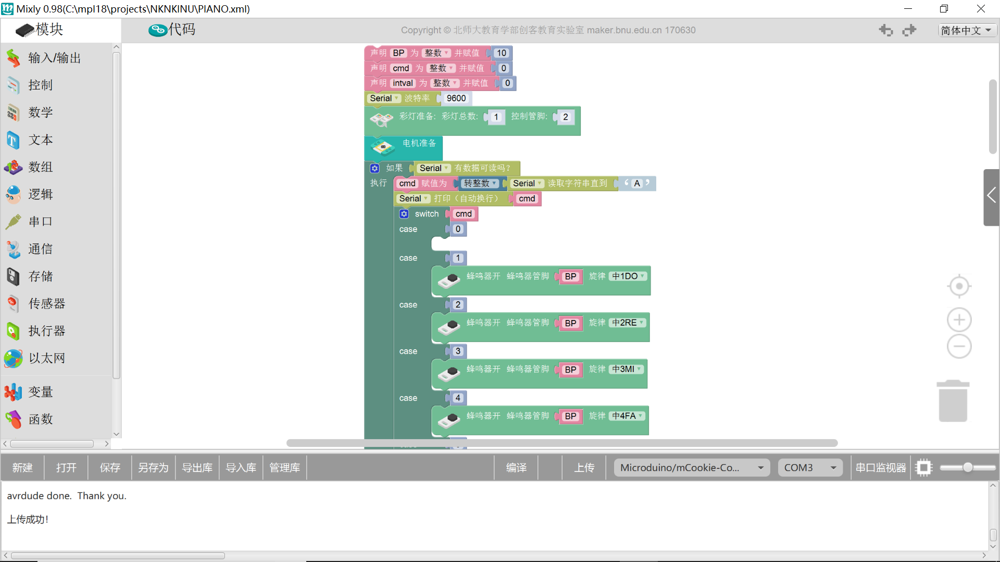
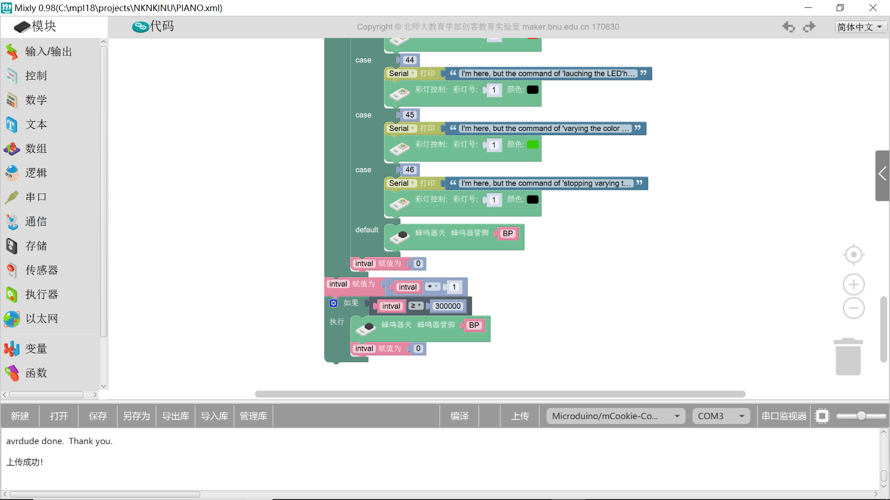
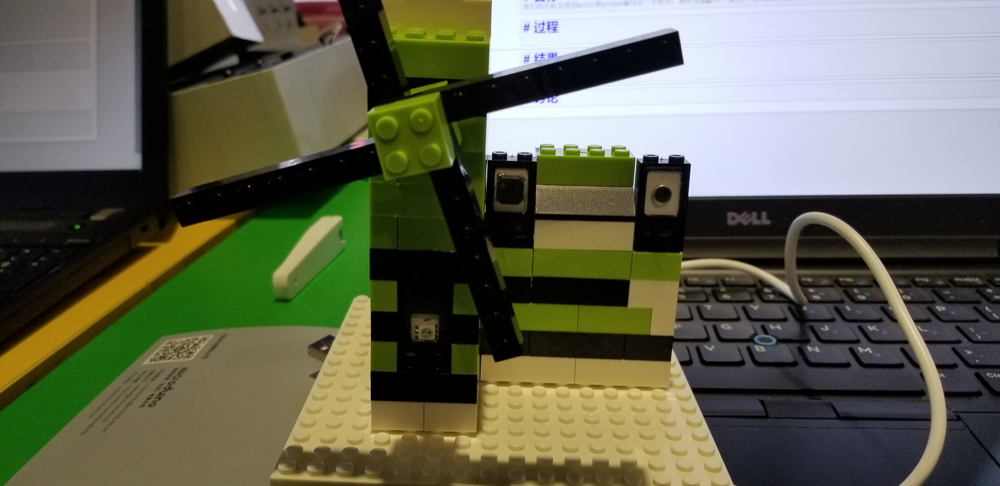

# final report

# 目标 
我们的目标是使用mixly和python编写出一个程序，制作出能发声、发光、电风扇转动的风车。

# 过程

我先使用电子积木搭建出一个如图的装置。然后修改老师的python程序，直到能够运行。代码如下。





```python
import serial
import serial.tools.list_ports
import time


def get_song_dictionary(input_lst):
    dictionary={}
    for i in range(len(songs)):
        song=songs[i]
        dictionary[song[0]]=i
    return dictionary

print ('hello')
ports = list(serial.tools.list_ports.comports())
print (ports)
for p in ports:
    print (p[1])
    if "SERIAL" in p[1] or "Serial" in p[1]:
	    ser=serial.Serial(port=p[0])
    else :
	    print ("No Arduino Device was found connected to the computer")

song1 = ['star','1','1','5','5','6','6','5','5','4','4','3','3','2','2','1','1']
song2 = ['hallo','1','2','3','1','1','2','3','1','3','4','5','3','4','5']

f = open('mysongs.csv', 'r')
data = f.read()
rows = data.split('\n')
print(rows[0:5])

songs=[]
for row in rows:
    song=row.split(',')
    songs.append(song)
print(songs)

album={}
album["tinkelstar"]=0
n=0
for song in songs:
    songname=song[0]
    print("songname is %s" %(songname))
    album[songname]=n
    n=n+1
print(album)

dic={"start_LED":'43',"stop_LED":'44',"start_fan":"41","stop_fan":'42'}

#songs_dictionary={'tinklestar':1,'dadaotuhao':2,'RadetzkyMarsch':3,'xjbsong':4,'clash royale':5}
songs_dictionary=get_song_dictionary(songs)

#song_dic={'tinkelstar':1,'dadaotuhao':2,'RadetzkyMarsch':3,'RadetzkyMarsch2':4,'xjbsong':5,'clash royale':6}
#ser=serial.Serial(port='COM4')
#ser=serial.Serial(port]='/dev/ttymodem542')
#ifha;oifhad;oifh
def run():

    action = "empty"
    while action != "q":
        print ('select 1.input song sequence, number,select 2 , input song namen , q and others for quit')
        action = input("> ")
        if action=='1' :
            print ('select in which song do you want to play:for example：1,2,3,4,5, q and others for quit')
            song_number = int(input("> "))
            print("song number is:")
            print(song_number)
            for notes in songs[song_number]:
                if notes.isdigit():
                    ser.write(notes.encode())
                    print ("send:"+notes)
                    print('A')
                    time.sleep(1)
                else:
                    if notes in dic:
                        s_notes=dic[notes]
                        print(s_notes)
                        ser.write(s_notes.encode())
                        print ("send:"+s_notes)
                        print('A')
        elif action == "2":
            print ('select in which song do you want to play:tinklestar,dadaotuhao,RadetzkyMarsch,xjbsong,clash royale,q and others for quit')
            song_name = input("> ")
            print("songs name is:")
            print(song_name)
            song_number=songs_dictionary[song_name]
            print("song number is:")
            print(song_number)
            for notes in songs[song_number-1]:
                ser.write(notes.encode())
                print ("send:"+notes)
                time.sleep(1)
        else :
            return
run()

```

    hello
    [<serial.tools.list_ports_common.ListPortInfo object at 0x000001C5B7373E80>]
    USB-SERIAL CH340 (COM3)
    ['tinkelstar,1,2,5,5,6,6,5,5,4,start_fan,4,3,3,2,2,stop_fan,1,1', 'dadaotuhao,1,2,3,1,1,2,3,1,start_LED,3,4,5,3,4,5,stop_LED,5,6,5,4,3,1,2,1,1', 'RadetzkyMarsch,4,4,4,4,4,4,4,3,2,1,7,6,7,1,2,7,5', 'RadetzkyMarsch2,4,3,4,4,3,4,4,3,4,3,2,6,5,6,6,5,6,6,4,5,7,6,4,3,4,3,2,3,2,1,7,6,5,4,3,2,2,2,', 'xjbsong,1,4,4,5,7,2,7,3,6,3,7,5,2,4,6,2,5,3,6,3,6,2,1']
    [['tinkelstar', '1', '2', '5', '5', '6', '6', '5', '5', '4', 'start_fan', '4', '3', '3', '2', '2', 'stop_fan', '1', '1'], ['dadaotuhao', '1', '2', '3', '1', '1', '2', '3', '1', 'start_LED', '3', '4', '5', '3', '4', '5', 'stop_LED', '5', '6', '5', '4', '3', '1', '2', '1', '1'], ['RadetzkyMarsch', '4', '4', '4', '4', '4', '4', '4', '3', '2', '1', '7', '6', '7', '1', '2', '7', '5'], ['RadetzkyMarsch2', '4', '3', '4', '4', '3', '4', '4', '3', '4', '3', '2', '6', '5', '6', '6', '5', '6', '6', '4', '5', '7', '6', '4', '3', '4', '3', '2', '3', '2', '1', '7', '6', '5', '4', '3', '2', '2', '2', ''], ['xjbsong', '1', '4', '4', '5', '7', '2', '7', '3', '6', '3', '7', '5', '2', '4', '6', '2', '5', '3', '6', '3', '6', '2', '1'], ['clash royale5', '6', '5', '4', '3', '4', '5', '2', '3', '4', '3', '4', '5'], ['']]
    songname is tinkelstar
    songname is dadaotuhao
    songname is RadetzkyMarsch
    songname is RadetzkyMarsch2
    songname is xjbsong
    songname is clash royale5
    songname is 
    {'tinkelstar': 0, 'dadaotuhao': 1, 'RadetzkyMarsch': 2, 'RadetzkyMarsch2': 3, 'xjbsong': 4, 'clash royale5': 5, '': 6}
    select 1.input song sequence, number,select 2 , input song namen , q and others for quit
    

# 结果
风车能发声、发光、转动。甚至还能完整地演奏一首曲子。


# 讨论
在一开始我的电机无法运行，在经过一系列地修改字典后，我终于成功了。但是，它演奏出来的音月空档都相同，无法体现较复杂的音乐。将来，我希望能通过更完整的代码，使它能演奏更完美的音乐。
